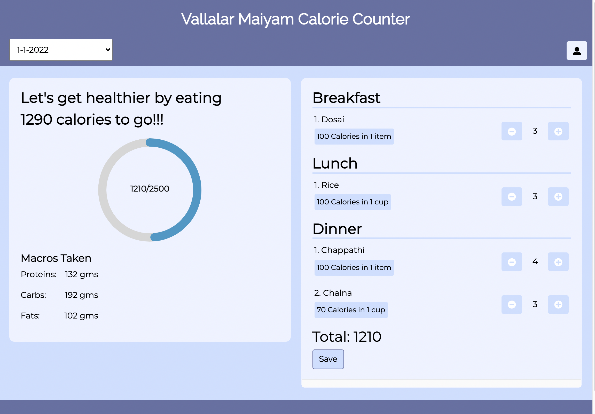

# Vallalar Maiyam Calorie Counter

A Progressive web app built for calorie counting of day to day foods provided by Vallalar Maiyam(college hostel mess). 

## Tech Stack

    Frontend - HTML, CSS, React JS
    Backend  - Firebase(Authentication, Realtime Database)
    Hosting  - Firebase(Hosting)

Website Link: https://vmc-counter.web.app/

*Since the website requires you to login but if you don't want to create an account, you can see the glimpse of how the website looks and works from the below images.*

## Login Page 

## Home Page

## New Entry Page

## User Profile

## Admin Page

Website Link: https://vmc-counter.web.app/
